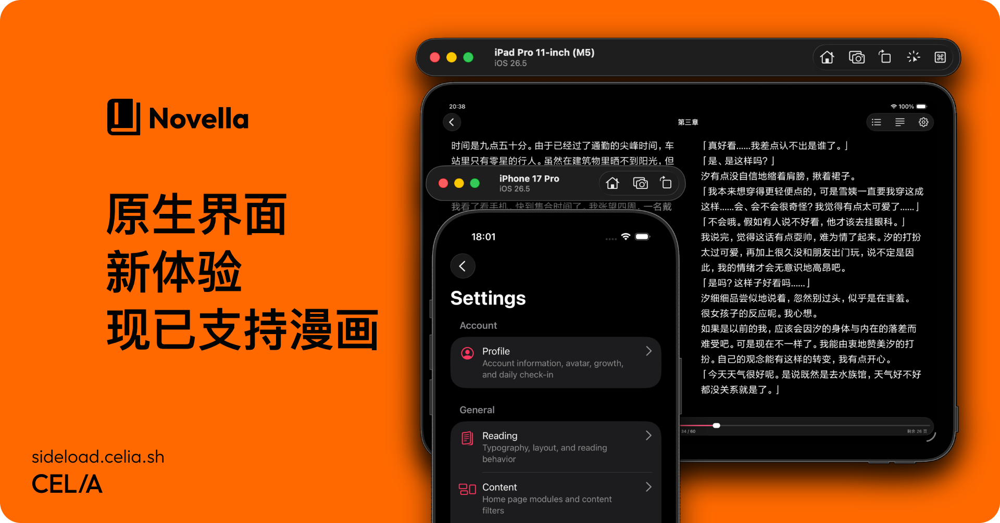

<p align="center">
  
</p>

# 📚 Novella — Android 移植

> **本仓库是 [celia-sh/Novella](https://github.com/celia-sh/Novella) 的修改版（modified version），为 Android 移植而维护。**
>
> 上游是**仅支持 iOS** 的客户端。本仓库在其基础上加入 Android 支持，**自 2026-09 起修改**。
> 依照 AGPL-3.0 第 5 条，此声明表明本仓库为修改版本并给出修改日期。
> 许可证不变，仍为 AGPL-3.0，见 [LICENSE](LICENSE)；上游版权归原作者所有。

<p>
  
  
  
  
</p>

轻书架第三方客户端，现支持 **iOS 与 Android**。

## 本仓库与上游的关系

|                | 上游 [celia-sh/Novella](https://github.com/celia-sh/Novella) | 本仓库 novella-droid  |
| -------------- | ------------------------------------------------------------ | --------------------- |
| 目标平台       | 仅 iOS                                                       | iOS + **Android**     |
| 定位           | 原项目                                                       | **修改版 / Android 移植** |
| 许可证         | AGPL-3.0                                                     | AGPL-3.0（不变）      |

本仓库的改动**集中在让原本 iOS 优先的代码库在 Android 上可构建、可运行**：新增 Android 原生工程配置、Config Plugin、构建约束与 CI。上游的 iOS 实现、共享包结构与应用层代码保持不变。

如果你要找的是原项目，请前往 **[celia-sh/Novella](https://github.com/celia-sh/Novella)**。上游的 Issue 与讨论也请走原仓库：

- Issues — <https://github.com/celia-sh/Novella/issues>
- Discussions — <https://github.com/celia-sh/Novella/discussions>

## Android 移植的现状

Android 侧已可完整构建：**debug 与 release 变体均能产出可安装的 APK**，release 变体以正式密钥签名。CI 会在每次 PR 上从零重建原生工程并编译，确保移植配置不会悄悄失效。

原生工程采用 CNG（Continuous Native Generation）：`apps/mobile/android/` 是**生成产物且已 gitignore**，不应手改——所有 Android 侧的原生配置都固化在 `apps/mobile/plugins/` 的 Config Plugin 中，`prebuild --clean` 可完整重建。

## 目录结构

- `apps/mobile` — React Native + Expo 移动端（iOS 与 Android）
- `apps/mobile/plugins` — Config Plugin：Android 原生配置的**唯一真相**
- `apps/mobile/modules` — 自定义 Expo 原生模块（`novella-ui`、`novella-readium`）
- `packages/*` — 与平台无关的客户端核心与协议（`api-client`、`client-core`、`platform-contracts`、`reader-engine`）

## 移动端开发

Expo CLI 命令统一在 `apps/mobile` 目录下执行：

```bash
cd apps/mobile
```

### Android（本仓库新增）

首次构建前，或安装/修改了含原生代码的依赖之后：

```bash
npx expo run:android
```

日常开发只改 JavaScript/TypeScript 时无需重新编译原生应用：

```bash
npx expo start
```

彻底重新生成 Android 原生工程（修改了 `app.config.ts`、Config Plugin 或原生依赖之后）：

```bash
npx expo prebuild --clean --platform android
npx expo run:android
```

**构建环境要求**（版本彼此耦合，改动前请先确认）：

| 组件          | 版本               | 说明                                  |
| ------------- | ------------------ | ------------------------------------- |
| JDK           | 17                 | Gradle 8.13 与 AGP 8.12 要求          |
| Android SDK   | platform 36        | `compileSdk`                          |
| Build Tools   | 36.1.0             | `buildToolsVersion`                   |
| NDK           | `27.1.12297006`    | React Native 0.86 指定                |
| CMake         | 3.22.1             | AGP 默认                              |
| Gradle        | **8.13**（锁定）   | 见下方「构建约束」                    |

### iOS

iOS 开发沿用上游流程，见 [CONTRIBUTING.md](CONTRIBUTING.md)。

## Android 构建约束（重要）

以下约束都由实测得出，**全部固化在 `apps/mobile/plugins/` 的 Config Plugin 中**；直接手改生成目录会在下次 `prebuild --clean` 时丢失。

- **Gradle 锁定 8.13。** Expo 模板自带 9.3.1，但本项目的 AGP/React Native 插件用到了 Gradle 9 移除的特性，9.x 无法构建。**升高前请先跑通完整构建。**
- **关闭新架构（`newArchEnabled=false`）。** 项目的原生模块使用的是 legacy ViewManager API 而非 Fabric codegen。该开关已不在 `ExpoConfig` 中、prebuild 也不再管理，只能由 Config Plugin 写入。
- **`targetSdk` 34 低于 `compileSdk` 36，这是刻意的。** 当年调整的原因未留档，**请勿随意调高**（涉及 Android 15 的强制边到边行为）。
- **只构建 `arm64-v8a` 单一 ABI**（模板默认四个），以缩短原生编译时间。
- **国内镜像。** Maven 走阿里云、Gradle 分发包走腾讯云，以免在 GFW 内解析依赖时长时间卡住。这些镜像是公开可达的，CI 也在用。
- **Windows MAX_PATH。** codegen 生成的 C++ 源在 `node_modules/` 下路径很深，会超出 Windows 的 260 字符限制而让 ninja 失败。修复是把 CMake 的 `CMAKE_OBJECT_PATH_MAX` 提到 **256**（默认 250 会让哈希差一个字符而失效）。该值按当前工作区深度调校，**仓库移到明显更深的路径需重算**。

### 发布构建（release）

release 变体使用正式密钥签名。密钥库位于 **`apps/mobile/.keystore/release.keystore`**（已 gitignore，`prebuild --clean` 不会删除），密码从环境变量读取，**不入库**：

```bash
export NOVELLA_KEYSTORE_PASSWORD='<密码>'
cd apps/mobile/android
./gradlew assembleRelease
```

> ⚠️ 该密钥库是已发布应用的签名身份，**一旦丢失就无法再推送更新**。请务必在仓库外单独备份，并同时保存密码与证书指纹以便校验恢复的是正确的密钥。

## CI

- `.github/workflows/validate.yml` — 边界检查、类型检查与单元测试
- `.github/workflows/android.yml` — **从零 `prebuild --clean` 重建 Android 原生工程并编译 debug APK**，同时断言各 Config Plugin 确实生效

注意：Android 工作流在 **Linux** 上运行。`CMAKE_OBJECT_PATH_MAX` 在 Linux 上同样生效，日志里也会出现同样的 "cannot be safely placed under this directory" 警告——差别只在 Linux 没有 260 字符路径上限，所以它止步于警告而非构建失败。因此该工作流验证的是「配置被正确应用且原生工程确实可构建」，而非 Windows 上的路径长度行为。

## 质量门槛

提交前请在仓库根目录运行：

```bash
npm run check        # 边界检查 + 类型检查
npm run test:client  # 客户端核心测试
npm run test:reader  # 阅读器相关测试
```

提交 PR 前请完成对应平台的功能回归；具体开发流程与代码约定见 [CONTRIBUTING.md](CONTRIBUTING.md)。

## 许可证

AGPL-3.0。参见 [LICENSE](LICENSE)。

本仓库为 [celia-sh/Novella](https://github.com/celia-sh/Novella) 的修改版，上游版权归原作者所有。
